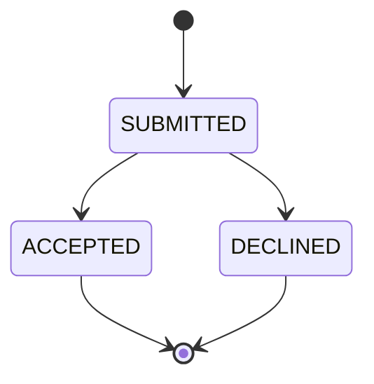
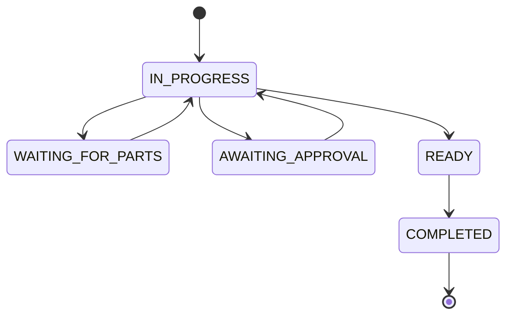

# 09 — State Models

## Repair Request state model

Keep the Request lifecycle deliberately small.

### SUBMITTED

Customer has submitted the Request to one Provider.

### ACCEPTED

Provider accepted the Request and one Repair was created.

### DECLINED

Provider will not create a Repair from the Request.

## Repair state model

## Status semantics

### IN_PROGRESS

General active work state covering technical activities such as intake review, diagnosing, repairing, and testing.

Those activities are intentionally not mandatory statuses.

### WAITING_FOR_PARTS

Provider manually selects this when work cannot continue because required part/material availability blocks the Repair.

Optional branch only.

### AWAITING_APPROVAL

Provider manually selects this when work cannot continue until the Customer approves proceeding.

Optional branch only.

### READY

Repair work is finished and the device is ready for return/handover according to the selected Service Mode.

Provider-neutral replacement for `READY_FOR_PICKUP`.

### COMPLETED

Repair engagement and return/handover are finished.

## Transition rules

MVP rules should be simple rather than attempting to model every real-world exception.

Implemented valid transitions:

| From              | To                |
| ----------------- | ----------------- |
| creation          | IN_PROGRESS       |
| IN_PROGRESS       | WAITING_FOR_PARTS |
| IN_PROGRESS       | AWAITING_APPROVAL |
| WAITING_FOR_PARTS | IN_PROGRESS       |
| AWAITING_APPROVAL | IN_PROGRESS       |
| IN_PROGRESS       | READY             |
| READY             | COMPLETED         |

Future evidence may justify:

- CANCELLED
- UNABLE_TO_REPAIR
- reopening a COMPLETED Repair

These are intentionally omitted until required.

Feature 04 enforces this graph in both the Repairs Module and the
`change_repair_status` transaction. The transaction locks the Repair row,
updates `current_status`, appends one matching Status Event, and maintains
`completed_at` atomically. Concurrent attempts re-evaluate the winning durable
state; a now-invalid loser is rejected. `COMPLETED` cannot be reopened.
